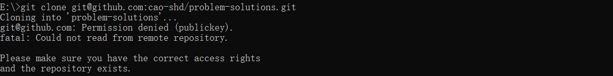
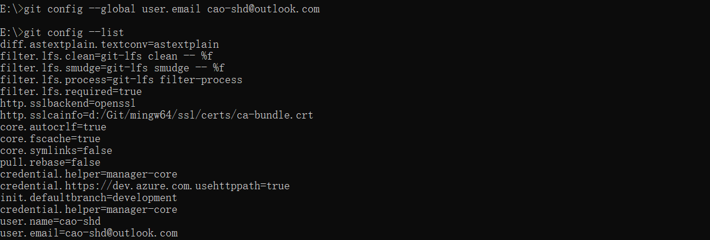
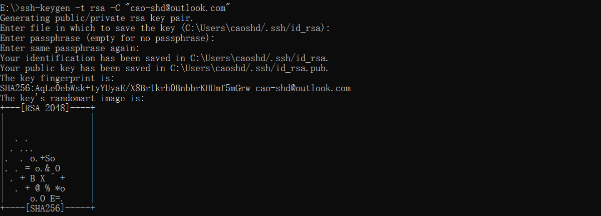
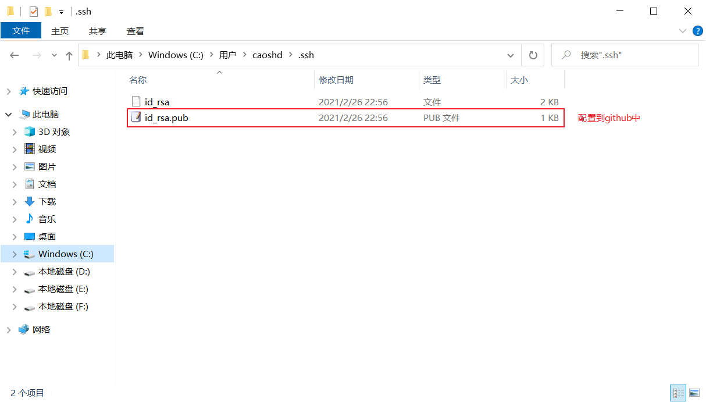
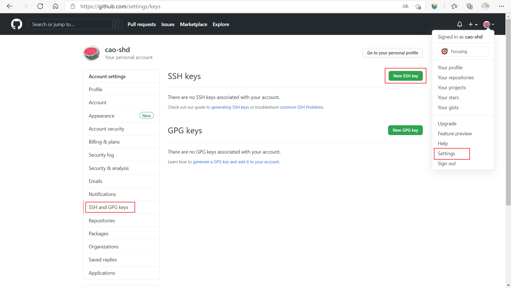
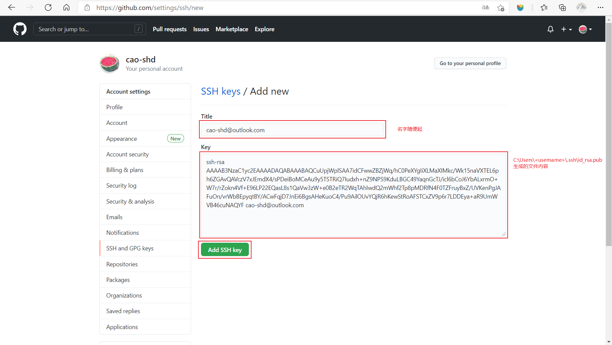
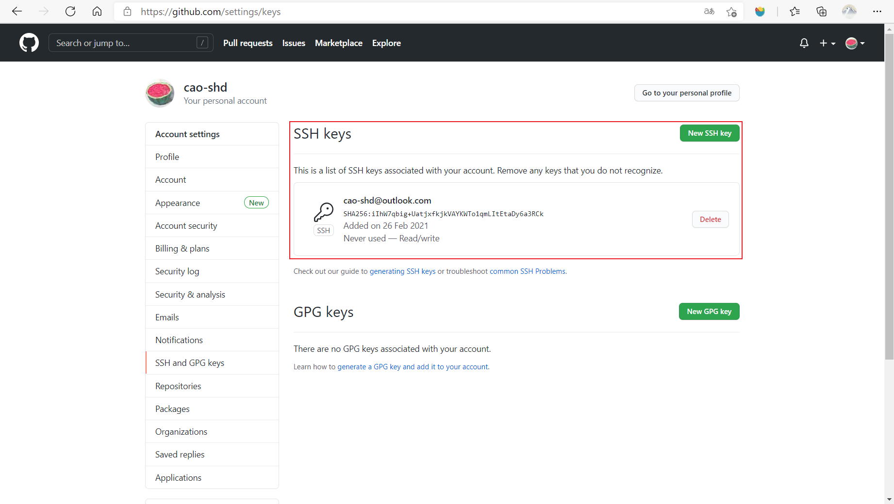
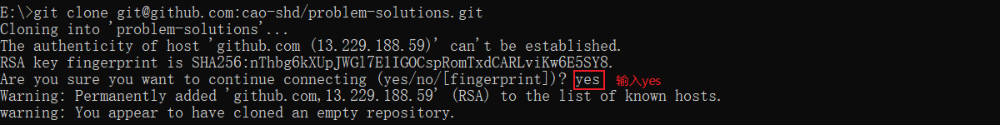

# Please make sure you have the correct access rights  and the repository exists.

<font color="blue">😤问题描述: </font> 

执行`git clone git clone git@github.com:cao-shd/problem-solutions.git`获取远程仓库工程时， 出现如下错误信息。



<font color="red">🤨错误信息: </font> 

**Please make sure you have the correct access rights  and the repository exists.**

<font color="green">😋解决办法: </font> 

1. 删除`C:\Users\<username>\.ssh`下所有所有文件
2. 打开 git bash 命令行
+ 添加配置信息
```
# 设置用户名
git config --global user.name <username>
# 设置邮箱
git config --global user.email <email_address>
```
+ 查看配置信息

```
# 查看设置
git config --list
```

+ 控制台显示如下



+ 生成 ssh使用的key (一直按Enter就可以)
```
ssh-keygen -t rsa -C "<email_address>"
```

+ 控制台显示如下



+ `C:\Users\<username>\.ssh`会生成如下文件



+ 在github中配置公钥信息







+ 重新执行命令验证



> 问题解决 🎉🎉🎉

