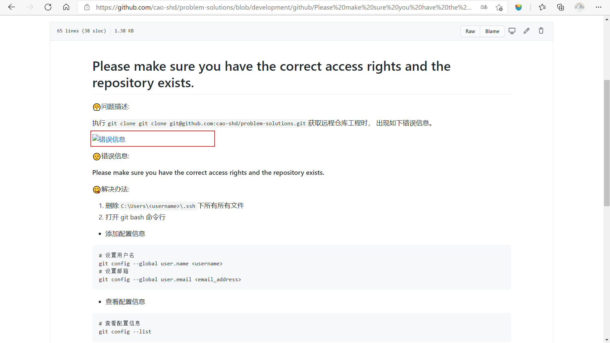
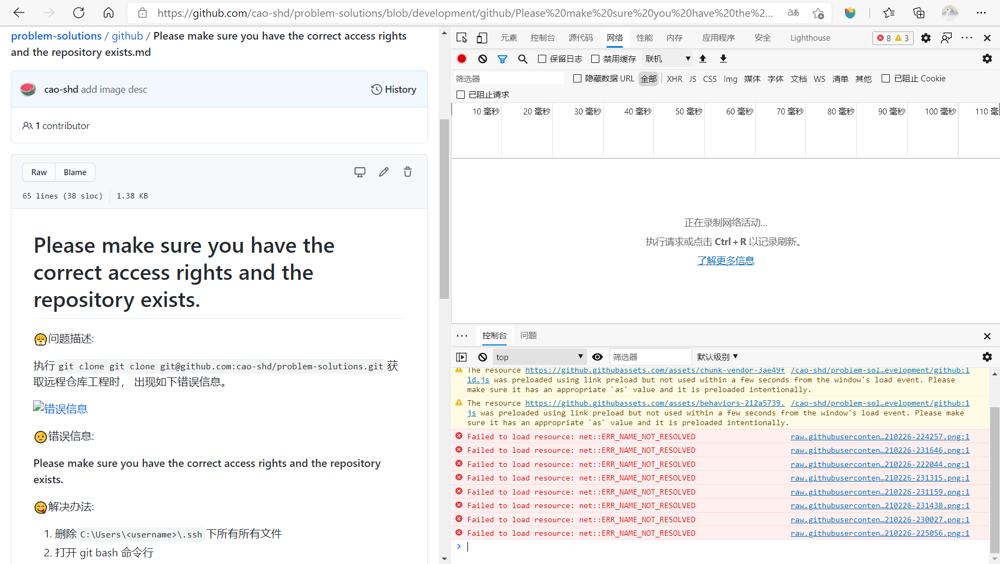
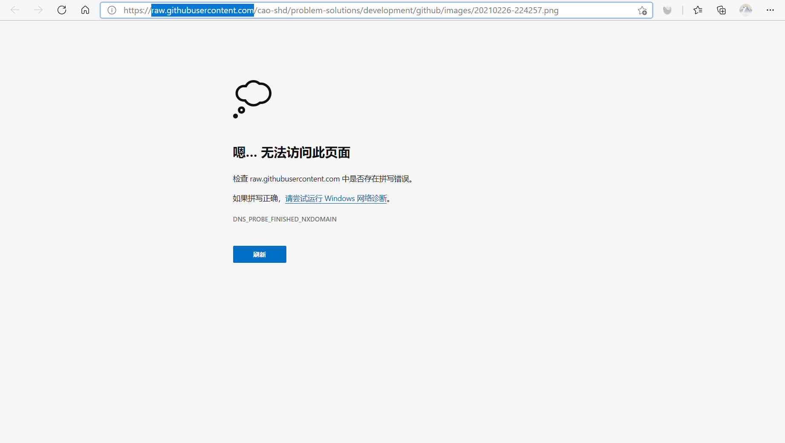
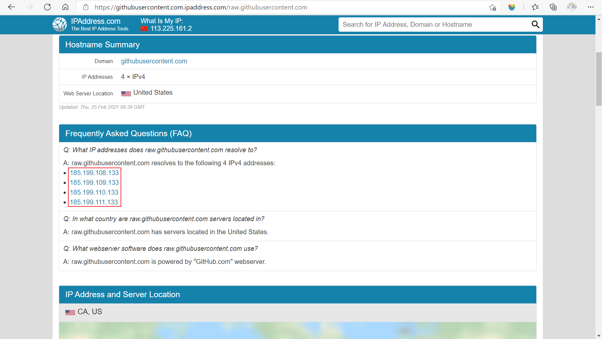
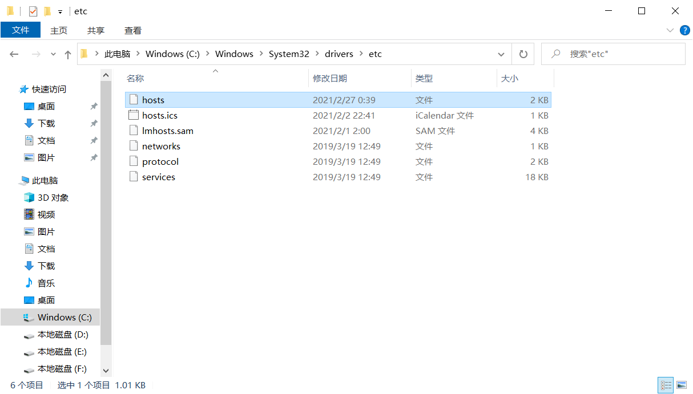
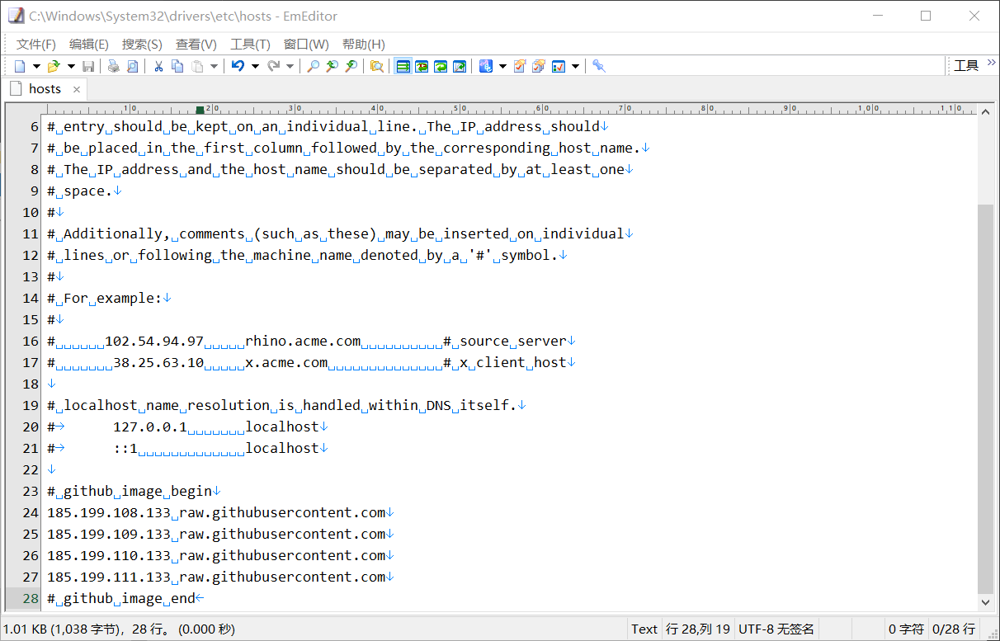
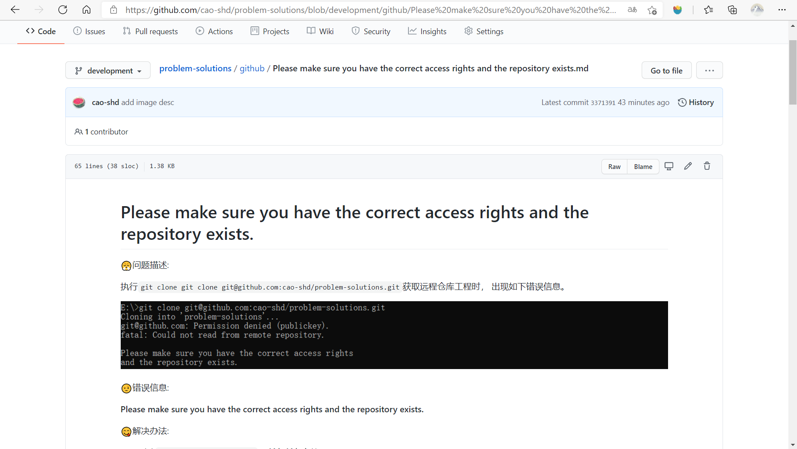

# 访问github图片无法显示

<font color="blue">😤问题描述: </font>

+ 访问github发现图片无法加载
  

<font color="green">😋解决办法: </font>

1. 打开浏览器控制台， 查看控制台输出
   
2. 点击url，复制错误的url域名 `raw.githubusercontent.com`
   
3. 进入[域名解析网站(https://www.ipaddress.com)](https://www.ipaddress.com)，查看域名对应的`IP`地址
   
4. 修改 host 文件

+ host文件位置: `C:\Windows\System32\drivers\etc`
  
+ 追加文件内容: 上记[3]中取得的IP地址
  ```
  185.199.108.133 raw.githubusercontent.com
  185.199.109.133 raw.githubusercontent.com
  185.199.110.133 raw.githubusercontent.com
  185.199.111.133 raw.githubusercontent.com
  ```
  

5. 刷新画面 验证图片是否可以显示
   

> 问题解决 🎉🎉🎉